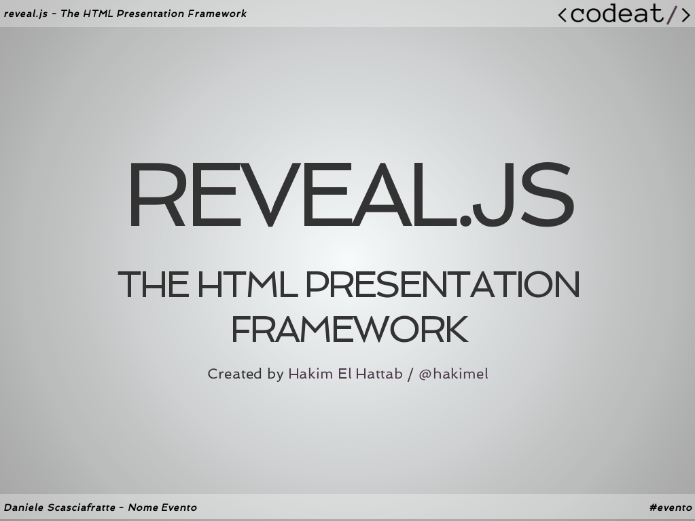

# reveal.js [](https://travis-ci.org/hakimel/reveal.js)



reveal.js comes with a broad range of features including [nested slides](https://github.com/hakimel/reveal.js#markup), [Markdown contents](https://github.com/hakimel/reveal.js#markdown), [PDF export](https://github.com/hakimel/reveal.js#pdf-export), [speaker notes](https://github.com/hakimel/reveal.js#speaker-notes) and a [JavaScript API](https://github.com/hakimel/reveal.js#api). It's best viewed in a modern browser but [fallbacks](https://github.com/hakimel/reveal.js/wiki/Browser-Support) are available to make sure your presentation can still be viewed elsewhere.


#### More reading:
- [Installation](#installation): Step-by-step instructions for getting reveal.js running on your computer.
- [Changelog](https://github.com/hakimel/reveal.js/releases): Up-to-date version history.
- [Examples](https://github.com/hakimel/reveal.js/wiki/Example-Presentations): Presentations created with reveal.js, add your own!
- [Browser Support](https://github.com/hakimel/reveal.js/wiki/Browser-Support): Explanation of browser support and fallbacks.
- [Plugins](https://github.com/hakimel/reveal.js/wiki/Plugins,-Tools-and-Hardware): A list of plugins that can be used to extend reveal.js.

## Instructions

### Markup

Markup hierarchy needs to be ``<div class="reveal"> <div class="slides"> <section>`` where the ``<section>`` represents one slide and can be repeated indefinitely. If you place multiple ``<section>``'s inside of another ``<section>`` they will be shown as vertical slides. The first of the vertical slides is the "root" of the others (at the top), and it will be included in the horizontal sequence. For example:

```html
<div class="reveal">
	<div class="slides">
		<section>Single Horizontal Slide</section>
		<section>
			<section>Vertical Slide 1</section>
			<section>Vertical Slide 2</section>
		</section>
	</div>
</div>
```

### Markdown

It's possible to write your slides using Markdown. To enable Markdown, add the ```data-markdown``` attribute to your ```<section>``` elements and wrap the contents in a ```<script type="text/template">``` like the example below.

This is based on [data-markdown](https://gist.github.com/1343518) from [Paul Irish](https://github.com/paulirish) modified to use [marked](https://github.com/chjj/marked) to support [Github Flavoured Markdown](https://help.github.com/articles/github-flavored-markdown). Sensitive to indentation (avoid mixing tabs and spaces) and line breaks (avoid consecutive breaks).

```html
<section data-markdown>
	<script type="text/template">
		## Page title

		A paragraph with some text and a [link](http://hakim.se).
	</script>
</section>
```

#### External Markdown

You can write your content as a separate file and have reveal.js load it at runtime. Note the separator arguments which determine how slides are delimited in the external file. The ```data-charset``` attribute is optional and specifies which charset to use when loading the external file.

When used locally, this feature requires that reveal.js [runs from a local web server](#full-setup).

```html
<section data-markdown="example.md"  
         data-separator="^\n\n\n"  
         data-separator-vertical="^\n\n"  
         data-separator-notes="^Note:"  
         data-charset="iso-8859-15">
</section>
```

#### Element Attributes

Special syntax (in html comment) is available for adding attributes to Markdown elements. This is useful for fragments, amongst other things.

```html
<section data-markdown>
	<script type="text/template">
		- Item 1 <!-- .element: class="fragment" data-fragment-index="2" -->
		- Item 2 <!-- .element: class="fragment" data-fragment-index="1" -->
	</script>
</section>
```

#### Slide Attributes

Special syntax (in html comment) is available for adding attributes to the slide `<section>` elements generated by your Markdown.

```html
<section data-markdown>
	<script type="text/template">
	<!-- .slide: data-background="#ff0000" -->
		Markdown content
	</script>
</section>
```

### Presentation Size

All presentations have a normal size, that is the resolution at which they are authored. The framework will automatically scale presentations uniformly based on this size to ensure that everything fits on any given display or viewport.

See below for a list of configuration options related to sizing, including default values:

```javascript
Reveal.initialize({

	...

	// The "normal" size of the presentation, aspect ratio will be preserved
	// when the presentation is scaled to fit different resolutions. Can be
	// specified using percentage units.
	width: 960,
	height: 700,

	// Factor of the display size that should remain empty around the content
	margin: 0.1,

	// Bounds for smallest/largest possible scale to apply to content
	minScale: 0.2,
	maxScale: 1.5

});
```


### Auto-sliding

Presentations can be configure to progress through slides automatically, without any user input. To enable this you will need to tell the framework how many milliseconds it should wait between slides:

```javascript
// Slide every five seconds
Reveal.configure({
  autoSlide: 5000
});
```
When this is turned on a control element will appear that enables users to pause and resume auto-sliding. Alternatively, sliding can be paused or resumed by pressing »a« on the keyboard. Sliding is paused automatically as soon as the user starts navigating. You can disable these controls by specifying ```autoSlideStoppable: false``` in your reveal.js config.

You can also override the slide duration for individual slides and fragments by using the ```data-autoslide``` attribute:

```html
<section data-autoslide="2000">
	<p>After 2 seconds the first fragment will be shown.</p>
	<p class="fragment" data-autoslide="10000">After 10 seconds the next fragment will be shown.</p>
	<p class="fragment">Now, the fragment is displayed for 2 seconds before the next slide is shown.</p>
</section>
```

Whenever the auto-slide mode is resumed or paused the ```autoslideresumed``` and ```autoslidepaused``` events are fired.


### Keyboard Bindings

If you're unhappy with any of the default keyboard bindings you can override them using the ```keyboard``` config option:

```javascript
Reveal.configure({
  keyboard: {
    13: 'next', // go to the next slide when the ENTER key is pressed
    27: function() {}, // do something custom when ESC is pressed
    32: null // don't do anything when SPACE is pressed (i.e. disable a reveal.js default binding)
  }
});
```

### Lazy Loading

When working on presentation with a lot of media or iframe content it's important to load lazily. Lazy loading means that reveal.js will only load content for the few slides nearest to the current slide. The number of slides that are preloaded is determined by the `viewDistance` configuration option.

To enable lazy loading all you need to do is change your "src" attributes to "data-src" as shown below. This is supported for image, video, audio and iframe elements.

```html
<section>
  
  <iframe data-src="http://slides.com"></iframe>
  <video>
    <source data-src="video.webm" type="video/webm" />
    <source data-src="video.mp4" type="video/mp4" />
  </video>
</section>
```

### Slide Backgrounds

Slides are contained within a limited portion of the screen by default to allow them to fit any display and scale uniformly. You can apply full page backgrounds outside of the slide area by adding a ```data-background``` attribute to your ```<section>``` elements. Four different types of backgrounds are supported: color, image, video and iframe. Below are a few examples.

```html
<section data-background="#ff0000">
	<h2>All CSS color formats are supported, like rgba() or hsl().</h2>
</section>
<section data-background="http://example.com/image.png">
	<h2>This slide will have a full-size background image.</h2>
</section>
<section data-background="http://example.com/image.png" data-background-size="100px" data-background-repeat="repeat">
	<h2>This background image will be sized to 100px and repeated.</h2>
</section>
<section data-background-video="https://s3.amazonaws.com/static.slid.es/site/homepage/v1/homepage-video-editor.mp4,https://s3.amazonaws.com/static.slid.es/site/homepage/v1/homepage-video-editor.webm">
	<h2>Video. Multiple sources can be defined using a comma separated list.</h2>
</section>
<section data-background-iframe="https://slides.com">
	<h2>Embeds a web page as a background. Note that the page won't be interactive.</h2>
</section>
```

Backgrounds transition using a fade animation by default. This can be changed to a linear sliding transition by passing ```backgroundTransition: 'slide'``` to the ```Reveal.initialize()``` call. Alternatively you can set ```data-background-transition``` on any section with a background to override that specific transition.

### Slide Transitions
The global presentation transition is set using the ```transition``` config value. You can override the global transition for a specific slide by using the ```data-transition``` attribute:

```html
<section data-transition="zoom">
	<h2>This slide will override the presentation transition and zoom!</h2>
</section>

<section data-transition-speed="fast">
	<h2>Choose from three transition speeds: default, fast or slow!</h2>
</section>
```

Note that this does not work with the page and cube transitions.


### Internal links

It's easy to link between slides. The first example below targets the index of another slide whereas the second targets a slide with an ID attribute (```<section id="some-slide">```):

```html
<a href="#/2/2">Link</a>
<a href="#/some-slide">Link</a>
```

You can also add relative navigation links, similar to the built in reveal.js controls, by appending one of the following classes on any element. Note that each element is automatically given an ```enabled``` class when it's a valid navigation route based on the current slide.

```html
<a href="#" class="navigate-left">
<a href="#" class="navigate-right">
<a href="#" class="navigate-up">
<a href="#" class="navigate-down">
<a href="#" class="navigate-prev"> <!-- Previous vertical or horizontal slide -->
<a href="#" class="navigate-next"> <!-- Next vertical or horizontal slide -->
```

### Fragments
Fragments are used to highlight individual elements on a slide. Every element with the class ```fragment``` will be stepped through before moving on to the next slide. Here's an example: http://lab.hakim.se/reveal-js/#/fragments

The default fragment style is to start out invisible and fade in. This style can be changed by appending a different class to the fragment:

```html
<section>
	<p class="fragment grow">grow</p>
	<p class="fragment shrink">shrink</p>
	<p class="fragment roll-in">roll-in</p>
	<p class="fragment fade-out">fade-out</p>
	<p class="fragment current-visible">visible only once</p>
	<p class="fragment highlight-current-blue">blue only once</p>
	<p class="fragment highlight-red">highlight-red</p>
	<p class="fragment highlight-green">highlight-green</p>
	<p class="fragment highlight-blue">highlight-blue</p>
</section>
```

Multiple fragments can be applied to the same element sequentially by wrapping it, this will fade in the text on the first step and fade it back out on the second.

```html
<section>
	<span class="fragment fade-in">
		<span class="fragment fade-out">I'll fade in, then out</span>
	</span>
</section>
```

The display order of fragments can be controlled using the ```data-fragment-index``` attribute.

```html
<section>
	<p class="fragment" data-fragment-index="3">Appears last</p>
	<p class="fragment" data-fragment-index="1">Appears first</p>
	<p class="fragment" data-fragment-index="2">Appears second</p>
</section>
```

### Code syntax highlighting

By default, Reveal is configured with [highlight.js](http://softwaremaniacs.org/soft/highlight/en/) for code syntax highlighting. Below is an example with clojure code that will be syntax highlighted. When the `data-trim` attribute is present surrounding whitespace is automatically removed.

```html
<section>
	<pre><code data-trim>
(def lazy-fib
  (concat
   [0 1]
   ((fn rfib [a b]
        (lazy-cons (+ a b) (rfib b (+ a b)))) 0 1)))
	</code></pre>
</section>
```

### Slide number
If you would like to display the page number of the current slide you can do so using the ```slideNumber``` configuration value.

```javascript
Reveal.configure({ slideNumber: true });
```

### Embedded media
Embedded HTML5 `<video>`/`<audio>` and YouTube iframes are automatically paused when you navigate away from a slide. This can be disabled by decorating your element with a `data-ignore` attribute.

Add `data-autoplay` to your media element if you want it to automatically start playing when the slide is shown:

```html
<video data-autoplay src="http://clips.vorwaerts-gmbh.de/big_buck_bunny.mp4"></video>
```

Additionally the framework automatically pushes two [post messages](https://developer.mozilla.org/en-US/docs/Web/API/Window.postMessage) to all iframes, ```slide:start``` when the slide containing the iframe is made visible and ```slide:stop``` when it is hidden.


### Stretching elements
Sometimes it's desirable to have an element, like an image or video, stretch to consume as much space as possible within a given slide. This can be done by adding the ```.stretch``` class to an element as seen below:

```html
<section>
	<h2>This video will use up the remaining space on the slide</h2>
    <video class="stretch" src="http://clips.vorwaerts-gmbh.de/big_buck_bunny.mp4"></video>
</section>
```

Limitations:
- Only direct descendants of a slide section can be stretched
- Only one descendant per slide section can be stretched


## PDF Export

Presentations can be exported to PDF via a special print stylesheet. This feature requires that you use [Google Chrome](http://google.com/chrome).
Here's an example of an exported presentation that's been uploaded to SlideShare: http://www.slideshare.net/hakimel/revealjs-300.

1. Open your presentation with `print-pdf` included anywhere in the query string. This triggers the default index HTML to load the PDF print stylesheet ([css/print/pdf.css](https://github.com/hakimel/reveal.js/blob/master/css/print/pdf.css)). You can test this with [lab.hakim.se/reveal-js?print-pdf](http://lab.hakim.se/reveal-js?print-pdf).
2. Open the in-browser print dialog (CMD+P).
3. Change the **Destination** setting to **Save as PDF**.
4. Change the **Layout** to **Landscape**.
5. Change the **Margins** to **None**.
6. Click **Save**.


### Full setup

Some reveal.js features, like external Markdown and speaker notes, require that presentations run from a local web server. The following instructions will set up such a server as well as all of the development tasks needed to make edits to the reveal.js source code.

1. Install [Node.js](http://nodejs.org/)

2. Install [Grunt](http://gruntjs.com/getting-started#installing-the-cli)

4. Clone the reveal.js repository
   ```sh
   $ git clone https://github.com/hakimel/reveal.js.git
   ```

5. Navigate to the reveal.js folder
   ```sh
   $ cd reveal.js
   ```

6. Install dependencies
   ```sh
   $ npm install
   ```

7. Serve the presentation and monitor source files for changes
   ```sh
   $ grunt serve
   ```

8. Open <http://localhost:8000> to view your presentation

   You can change the port by using `grunt serve --port 8001`.


### Folder Structure
- **css/** Core styles without which the project does not function
- **js/** Like above but for JavaScript
- **plugin/** Components that have been developed as extensions to reveal.js
- **lib/** All other third party assets (JavaScript, CSS, fonts)


## License

MIT licensed

Copyright (C) 2015 Hakim El Hattab, http://hakim.se
