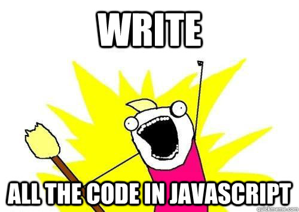
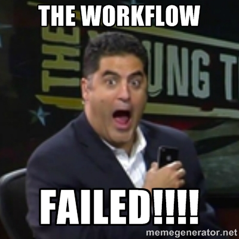
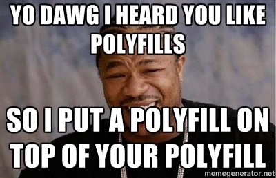

##FirefoxOS Boilerplate App

Programmare con una marcia in più!

>Firefox Os WorkShop Bari  
>Relatore: Mte90 alias Daniele Scasciafratte (@Mte90Net)

##Chi sono

Sono Daniele Scasciafratte conosciuto nel web come [Mte90](http://www.mte90.net)

* Programmatore amante dell'Open Source e della sua filosofia
* Geek da quando ho iniziato a smontare oggetti elettronici
* Utente Debian (Sid) GNU/Linux dal 2009
* Amante di KDE e delle Qt
* Fan di Mozilla da sempre
* Firefox OS Training Lead per l'Italia
* Programmatore Wordpress tra un accidenti e l'altro

##Il talk
Sarà un talk molto veloce in cui vedremo cos'è il Boilerplate, che API ci sono e quanto ci sarà utile per il workshop

##Vincere facile
  
Codice già pronto per fare foto, aggiungere un contatto in rubrica, inviare un SMS, aprire un video, verificare la batteria, dove siamo, come fare il caffè ecc.

##Firefox OS Boilerplate App
* Funziona
* Contiene esempi per la maggior parte delle API
* Il tema grafico è quello di **Gaia** 
* Multilingua
* Open Web Apps

##Vediamo le API
Prima di farvi vedere il boilerplate in diretta parliamo un'attimo delle API disponibili

##Quante API in giro
  
  
Alcune API native di FirefoxOS

> WebTelephony, Vibration API, WebSMS, Idle API, Screen Orientation, Settings API, Power manager API, Mobile Connection API, TCP Socket API, Geolocation API, WiFi Information API, Device Storage API, Contacts API, Mouse Lock API, Open WebApps, WebBluetooth, Network Information API, Battery Status API, Alarm API, Browser API, Time/Clock API, Web Activities, Push Notification API, Permission API, WebFM API, FileHandle API, Network Stats API, WebPayment

##Da non dimenticare
Le API sono presentate al **W3C** come draft, per farle diventare degli standard HTML5

**Alcune API sono disponibili solo per App certificate**

##App a pagamento
  
Mozilla ha realizzato un API in Javascript per i pagamenti   
Fonte: <https://developer.mozilla.org/en-US/docs/Web/Apps/Publishing/In-app_payments>  
<small>Approfondimento: [Working with receipts for paid apps](https://hacks.mozilla.org/2013/10/working-with-receipts-for-paid-apps/)</small>

##Javascript is everywhere!
  
Per usare tutte queste API si usa JavaScript!  

##Workflow
 

##Workflow di sviluppo
* Creare un manifest.webapp
* Realizzare la UI
* Sviluppare e provare tramite browser
* Testare sul simulatore/device
* Se Hosted caricare sul proprio server web (anche Github per esempio)
* Se Packaged comprimere tutto in un file zip

##Polyfill
  
Esiste una polyfill per usare le MozActivity sul proprio browser, utile per il debug  
Link: [https://github.com/Mte90/moz-polyfills](https://github.com/Mte90/moz-polyfills)

##Il boilerplate
Dopo tutta questa teoria vediamo il boilerplate!

##Le cartelle:

* css - La grafica
* fonts - Il font Fira
* images - Logo e immagini per la grafica
* js - Il codice che ci interessa
* locales - le varie traduzioni
* manifest.appcache - Saltiamolo per oggi
* manifest.webapp - I metadata dell'applicazione
* index.html - Il markup dell'applicazione

##Il codice javascript

* base.js - Installa l'applicazione tramite il manifest
* l10n.js - Libreria per il multilingua (sfrutta dei file ini)
* offline.js - Verifica se siamo connessi 
* webapp.js - La magia

##Webapp.js

Questo file contiene i vari esempi per molte WebActivity ed anche alcune funzionalità HTML5 (quindi standard)  
<small>PS: Daniele ricordati di aprire l'editor e di fare vedere il boilerplate!</small>

##Siti web di riferimento

* [Mozhacks](https://hacks.mozilla.org/category/firefox-os/) - Il blog di Mozilla dedicato agli sviluppatori
* [Mozilla Developer Network](https://developer.mozilla.org/it/) - La miglior fonte di informazione per lo sviluppo web
* [Developers Hub](https://marketplace.firefox.com/developers/) - Portale del Marketplace dedicato agli sviluppatori
* [Building FirefoxOS](http://buildingfirefoxos.com/) - Esempi, codice e documentazione per gli sviluppatori
* [Github](http://www.github.com) - Molte applicazioni sono presenti su Github
* [https://github.com/robnyman/Firefox-OS-Boilerplate-App](https://github.com/robnyman/Firefox-OS-Boilerplate-App)

##
  
Se avete domande fatele adesso o mai più (scherzo)  
 
Link presentazione: [http://goo.gl/I6hZWM](http://goo.gl/I6hZWM)  
Presentazione di:  
Daniele Scasciafratte - http://twitter.com/Mte90Net - [Mte90.net](http://www.mte90.net)