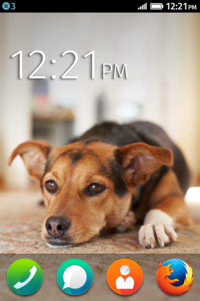

##FirefoxOS per utenti e sviluppatori

Scopriamo le sue caratteristiche! 

>Linux Day 2013 - Roma  
>Relatore: Mte90 alias Daniele Scasciafratte (@Mte90Net)

##Chi sono

Sono Daniele Scasciafratte conosciuto nel web come [Mte90](http://www.mte90.net)

* Programmatore amante dell'Open Source e della sua filosofia
* Geek da quando ho iniziato a smontare oggetti elettronici
* Utente Debian (Sid) GNU/Linux dal 2009
* Amante di KDE e delle Qt
* Fan di Mozilla da sempre
* Primo talk (abbiate pietà)
* Sbaglio spesso la pronuncia dei nomi di software e termini tecnici

##Il talk
**La parte utente e sviluppatore è mischiata in alcune parti del talk**  

Per gli sviluppatori è solo un talk di introduzione, per approfondire l'argomento fate riferimento ai link nelle slide  

Durante il talk se ci sarà tempo e modo vi mostrerò il Keon e il Simulatore  

Alla fine potrete provare il mio Keon (FirefoxOs Phone Developer Preview) e farmi delle domande (sempre che io sappia la risposta!)

##Vi presento FirefoxOS

 
**<a href="http://www.youtube.com/watch?v=DjjkAYI5kNM&hd=1" target="_blank">Clicca questo bel link!</a>**

##Cos'è FirefoxOS
  
FirefoxOS **nome in codice Boot to Gecko** è un sistema operativo basato su **Linux** ed **Android**, utilizza standard completamente aperti e il suo codice è disponibile durante lo sviluppo delle varie versioni (Android mi leggi?)

Fonte: [https://developer.mozilla.org/en-US/docs/Mozilla/Firefox_OS](https://developer.mozilla.org/en-US/docs/Mozilla/Firefox_OS)

##Screenshot

##Screenshot

##Screenshot

##Screenshot

##Perchè costa poco?
  

* Mozilla propone **standard aperti**
* Non ha intenzione di lucrare sul suo sistema
* Punta su **dispositivi di fascia bassa** (almeno inizialmente)  
* Componenti non molto potenti
* Pensato per portare il web mobile a tutti (anche nei paesi in sviluppo)
* FirefoxOS è un sistema fluido e funzionale senza grandi esigenze

##Gonk, Gecko e Gaia
  
Un sistema FirefoxOS è diviso in tre layer o livelli:

* Gonk - Il livello più basso ovvero il kernel e le librerie di sistema
* Gecko - Il motore grafico e le virtual machine Javascript
* Gaia - L'interfaccia utente (tutto ciò che viene mostrato a schermo)

Fonte: <https://developer.mozilla.org/en-US/docs/Mozilla/Firefox_OS/Platform/Architecture>

##Gecki dappertutto
  
L'interfaccia non è altro che un browser che sfrutta il motore grafico **Gecko** per mostrare le varie applicazioni  

Tutte le applicazioni sono realizzate con i tre Assassini ovvero **HTML/CSS/JS**  

<small>Il sistema è integrato pesantemente con Gecko quindi non si può sostituire con WebKit!</small>

##La leggenda delle Web App lente
  
L'app di Facebook **realizzata in HTML5** era molto lenta e successivamente venne realizzata un app nativa  

È stata realizzata malamente infatti per dimostrare la bontà delle Web App **Sencha (ex ExtJS)** realizzò un [clone in HTML5](http://www.sencha.com/blog/the-making-of-fastbook-an-html5-love-story) funzionante  

##Web App è fico
In un sistema ottimizzato come **FirefoxOS** (sfruttando strumenti e librerie per il mobile) si può ottenere una app con le stesse performance di una nativa  

Esempi di tool da usare:

* jQuery 2.* invece di jQuery 1.x
* Zepto invece di jQuery
* Mini Framework Javascript 
* Framework CSS responsive

Dovete pensare a realizzare una Web App specificatamente per il mobile quindi **il supporto a Internet Explorer lo potete lasciare a casa**

## I crash
  
Le applicazioni sono sotto **sandbox**!  

Ogni file Javascript ha un suo processo, quindi isolamento dei crash (il file và in crash non l'applicazione o il sistema) e un facile debug

##Web App Hosted vs Packaged
FirefoxOS ha due tipi di applicazioni che si **differenziano dai permessi** che hanno sul dispositivo e se **si installano sul dispositivo**
  
Vediamole meglio
  
Fonte: [https://developer.mozilla.org/en-US/Apps/Developing/Packaged_apps](https://developer.mozilla.org/en-US/Apps/Developing/Packaged_apps)

##Hosted

* Con AppCache si possono cachare dei file per uso offline
* Le app sono online quindi su siti web
* Permessi limitati su alcune API (slide successiva)

  
App di esempio:  

* Facebook
* Twitter

##Privilegi per app Hosted
**Privilegi non critici**

* Geolocazione
* Storage (localStorage/sessionStorage/Appcache)
* Sveglia
* Radio
* Notifiche

Fonte: [https://developer.mozilla.org/en-US/docs/WebAPI/Permissions](https://developer.mozilla.org/en-US/docs/WebAPI/Permissions)

##Packaged

* Accesso in scrittura e lettura sul telefono
* Possono lavorare anche offline
* Accesso a tutte le API
* Pacchettizate in uno zip

  
App di esempio:

* Tutte quelle presenti di base

##Quante API in giro
  
Le API sono presentate al **W3C** come draft  
<small>Le implementazioni dei vari protocolli TCP, SMTP, Socket e molti altri sono in JavaScript</small>  
Alcune API native di FirefoxOS

> WebTelephony, Vibration API, WebSMS, Idle API, Screen Orientation, Settings API, Power manager API, Mobile Connection API, TCP Socket API, Geolocation API, WiFi Information API, Device Storage API, Contacts API, Mouse Lock API, Open WebApps, WebBluetooth, Network Information API, Battery Status API, Alarm API, Browser API, Time/Clock API, Web Activities, Push Notification API, Permission API, WebFM API, FileHandle API, Network Stats API, WebPayment

**Alcune API sono disponibili solo per App certificate**

##App a pagamento
  
Mozilla ha realizzato un API in Javascript per i pagamenti   
Fonte: <https://developer.mozilla.org/en-US/docs/Web/Apps/Publishing/In-app_payments>  
<small>Approfondimento: [Working with receipts for paid apps](https://hacks.mozilla.org/2013/10/working-with-receipts-for-paid-apps/)</small>

##Cos'è il Manifest
Il file [manifest.webapp](https://developer.mozilla.org/en-US/docs/Web/Apps/Manifest) è un file JSON contenente le informazioni sull'applicazione  

* Nome, descrizione, lingue supportate e dati sullo sviluppatore
* Orientamento richiesto
* Il percorso di lancio dell'applicazione e le icone
* I permessi richiesti
  
Questo file è **obbligatorio** perchè informa come avviare/usare/richieste l'applicazione  
  <small>PS: Ha un Content-Type specifico _application/x-web-app-manifest+json_ quindi bisogna mandare degli header specifici per questo file tramite il web server </small>

##Marketplace
  
Ogni sito può permettere lo scaricamento di app (tramite il file manifest) quindi è possibile fare un marketplace personale (su [github](https://github.com/mozilla/zamboni) si trova quello ufficiale)  

**Tutte le app vengono testate da volontari (con dispositivi fisici) per controllare i requisiti e se funziona!**  
Fonte: <https://marketplace.firefox.com/developers/>

##Requisiti per lo store ufficiale
Gli indispensabili:

* I privilegi (i permessi) che l'app usa devono essere documentati
* Niente iframe per caricare i contenuti dell'app
* Screenshot obbligatorio
* Le lingue specificate devono essere presenti nell'applicazione
* Non compromettere il sistema
* Non usare tasti fisici per la navigazione perchè non presenti
* I pulsanti o link devono essere cliccabili/tappabili facilmente
* Regole di buon senso (niente spam, phishing, nessun contenuto illegale)

Fonte: <https://developer.mozilla.org/en-US/docs/Web/Apps/Publishing/Marketplace_review_criteria>

##Cosa consiglio

* La descrizione dell'applicazione deve essere esaustiva
* Se è un gioco deve contenere le istruzioni e non la partita già avviata
* L'interazione deve essere semplice per le varie interfacce (desktop, mobile, tablet)
* Specificare se per Desktop, Mobile, Tablet o per Firefox for Android
* Controllare il file manifest se è corretto tramite il [validatore](https://marketplace.firefox.com/developers/validator)

##Come testare la propria applicazione
Oltre ai dispositivi fisici esiste il simulatore di FirefoxOS che è una estensione per Firefox disponibile per [Windows, Mac e Linux](https://addons.mozilla.org/it/firefox/addon/firefox-os-simulator/)  

NB: La versione 1.1 di FirefoxOS usa Gecko 18 con backport di sicurezza della 20 mentre la 1.2 ha Gecko 26

##Differenze tra simulatore e device fisici
  
Il simulatore sfrutta l'hardware del computer e la versione Gecko di Firefox usata!   
<small>Alcune API non sono supportate 
Fonte: [https://developer.mozilla.org/en-US/docs/Mozilla/Firefox_OS/Platform/Feature_support_chart](https://developer.mozilla.org/en-US/docs/Mozilla/Firefox_OS/Platform/Feature_support_chart)</small>

##Debugging remoto
Tramite Firefox e un dispositivo con FirefoxOS o Firefox for Android collegato al pc è possibile farlo  

Fonte: <https://developer.mozilla.org/en-US/docs/Tools/Remote_Debugging>

##Come fare un app
* Un'App è un sito web pensato per più interfacce (Desktop, Smartphone e Tablet)
* Esiste un [boilerplate ufficiale](https://github.com/robnyman/Firefox-OS-Boilerplate-App) contenente esempi per la maggior parte delle API e diversi esempi
* Il tema grafico fà parte di **Gaia** e si trova nel boilerplate  
 
Se conosci HTML/CSS/JS ti basta sapere questo!!
   
La documentazione di riferimento è il portale dedicato sul [Mozilla Developer Network](https://developer.mozilla.org/en-US/docs/Mozilla/Firefox_OS)

##Workflow di sviluppo
* Creare un manifest.webapp
* Realizzare la UI
* Sviluppare e provare tramite browser/simulatore/device
* Se Hosted caricare sul proprio server web (anche Github per esempio)
* Se Packaged comprimere tutto in un file zip
* Inviare l'app sul Marketplace per la recensione

##Cosa sono le Web Activity
Permettono di interfacciare le applicazioni tra di loro (esempio scattare una foto e caricarla su Facebook con l'app ufficiale)

Fonte: <https://hacks.mozilla.org/2013/01/introducing-web-activities/>

##Web Components
Sono in [Working Draft](http://www.w3.org/TR/2013/WD-components-intro-20130606/) dal W3C e supportati da Chrome e Firefox (c'è una polyfill di nome X-Tag).  
Si trattano di nuovi elementi (i widget in poche parole) con tag HTML personalizzati  
Le librerie [Polymer](http://www.polymer-project.org/) di Google e [Brick](http://mozilla.github.io/brick/) di Mozilla ne includono già pronte come un calendario o la barra di stato.  

Fonti: [HTML5Rocks](http://www.html5rocks.com/en/tutorials/webcomponents/customelements/), [Introducing Brick](https://hacks.mozilla.org/2013/08/introducing-brick-minimal-markup-web-components-for-faster-app-development/), [Speed Up App Development with X-Tag and Web Components](https://hacks.mozilla.org/2013/05/speed-up-app-development-with-x-tag-and-web-components/)

##Varie
  
Quei dettagli che fanno la differenza ma che non sapevo dove mettere

##Quante volpi
  
Le app presenti sul Marketplace sono per quattro tipi diversi di interfacce/dispositivi  

* Firefox Desktop
* Firefox for Android
* FirefoxOS per smartphone
* FirefoxOS per tablet

Nel manifest deve essere specificato (il supporto verrà testato!)

##Le differenze tra Firefox
Il marketplace è disponibile per questi quattro ambienti ma la differenza principale è l'API che supportano (es: la versione desktop non ha l'Orientation API) e la risoluzione  

Se installate un'app su desktop creerà una icona nel menu del sistema, su mobile invece nello screen o nel menu  

Cari sviluppatori avete un grande mercato!

##Giochi
  
I giochi disponibili al momento non sfruttano **WebGL** perché i dispositivi non hanno hardware che ne permetta l'uso  

Attualmente si possono trovare giochi realizzati in modo classico senza 3D  

<small>Aprrpfondimento: [Optimizing your JavaScript game for Firefox OS](https://hacks.mozilla.org/2013/05/optimizing-your-javascript-game-for-firefox-os/)</small>

##FirefoxOS multi dispositivo
FirefoxOS è scaricabile e compilabile tramite la guida per molti dispositivi ma pochi sono supportati ufficialmente  
  
La pagina su [XDA Developers](http://forum.xda-developers.com/tags.php?tag=firefox+os) contiene diversi esperimenti di porting  
I requisiti per la [compilazione](https://developer.mozilla.org/en-US/docs/Mozilla/Firefox_OS/Firefox_OS_build_prerequisites), [ambiente per la compilazione](https://developer.mozilla.org/en-US/docs/Mozilla/Firefox_OS/Preparing_for_your_first_B2G_build), come fare un [porting](https://developer.mozilla.org/en-US/docs/Mozilla/Firefox_OS/Porting) e la guida per la [compilazione](https://developer.mozilla.org/en-US/docs/Mozilla/Firefox_OS/Building) si trovano su MDN

##Si può rootare
FirefoxOS si può compilare per ogni device, quindi è possibile compilare il kernel con le opzioni di root anche se questa funzionalità non è necessaria per l'implementazione dei permessi

Fonte:[https://developer.mozilla.org/en-US/docs/Mozilla/Firefox_OS/Security](https://developer.mozilla.org/en-US/docs/Mozilla/Firefox_OS/Security)

##Durata della batteria
Secondo il mio parere la durata è maggiore perchè:  

* Hardware poco esoso
* Schermi piccoli (dettaglio relativo)
* Perchè FirefoxOS è fatto con amore per l'Open Source (FLAME!!!)

##Italiano
  
FirefoxOS è tradotto in italiano e si può trovare nella 1.1, per chi vuole approfondire c'è la community [Mozilla Italia](https://mozillaitalia.org)

##Mozilla Italia cerca te!
  
Cerchiamo traduttori, grafici, volontari, markettari, sviluppatori, amanti dell'Open Source.  
Cerchiamo anche un grafico per la realizzazione vettoriale del logo!  
Per concludere stiamo discutendo il restyle del portale [http://goo.gl/tAYwfN](http://goo.gl/tAYwfN)

Fonte: [Rethinking mozillaitalia.org #1](http://www.pseudotecnico.org/blog/2013/04/21/rethinking-mozillaitalia-org-1/),
[A tempo perso (aka Rethinking mozillaitalia.org #1.1)](http://www.pseudotecnico.org/blog/2013/05/01/a-tempo-perso-aka-rethinking-mozillaitalia-org-1-1/)

##Siti web di riferimento

* [Mozhacks](https://hacks.mozilla.org/category/firefox-os/) - il blog di Mozilla dedicato agli sviluppatori
* [Mozilla Developer Network](https://developer.mozilla.org/it/) - La miglior fonte di informazione per lo sviluppo web
* [Developers Hub](https://marketplace.firefox.com/developers/) - portale del Marketplace dedicato agli sviluppatori
* [FirefoxOS Guide](http://firefoxosguide.com/) - La miglior fonte di informazione su FirefoxOS per sviluppatori e appassionati
* [Building FirefoxOS](http://buildingfirefoxos.com/) - Esempi, codice e documentazione per gli sviluppatori
* [Github](http://www.github.com) - Molte applicazione e i prodotti Mozilla sono qui
* [Html5AndMore](http://html5andmore.info) - Il portale dove scriverò una serie di lezioni sullo sviluppo per FirefoxOS

##Documenti di riferimento per la presentazione

* [FirefoxOSAppDays a Roma io c’ero!](http://www.mte90.net/2013/01/firefoxosappdays-a-roma-io-cero/) - Il mio reportage del FFOS AppDays a Roma di gennaio
* Le [presentazioni](http://firefoxos.nois3lab.it) del FFOS AppDays a Roma di Gennaio di Carlo Frinolli, Luca Greco e Andrea Marchesini
* [FirefoxOS, OpenWebApps and Developer Tools](http://learn.alcacoop.it/2013/firefoxos/workshop/) di Luca Greco
* [HTML5 Beyond the Hype: Current Issues & Near-Future Solutions](http://icant.co.uk/talks/h5/360i/) di Chris Heilmann
* MozHacks e MDN

##Applicazioni di esempio

* [Porting A PhoneGap App To Firefox OS](http://www.tricedesigns.com/2013/08/08/porting-a-phonegap-app-to-firefox-os/)
* [Building a Photo Sharing app for Firefox OS](https://blog.stackmob.com/2013/10/building-a-photo-sharing-app-for-firefox-os/)
* [Building a FirefoxOS App for my favorite Internet radio station](https://hacks.mozilla.org/2013/10/building-a-firefoxos-app-for-my-favorite-internet-radio-station/)
* [Firefox OS Boilerplate App](https://github.com/robnyman/Firefox-OS-Boilerplate-App)
* [NinjaRSS](https://github.com/Mte90/NinjaRSS) - [Demo](http://www.mte90.net/ffos/)

##
  
Se avete domande fatele adesso o mai più (scherzo)  
 
Link presentazione: [http://goo.gl/0rTcyh](http://goo.gl/0rTcyh)  
Per commentare la presentazione [http://forum.mozillaitalia.org/index.php?topic=59199](http://forum.mozillaitalia.org/index.php?topic=59199)  
Presentazione di:  
Daniele Scasciafratte - [@Mte90Net](http://twitter.com/Mte90Net) - [Mte90.net](http://www.mte90.net)