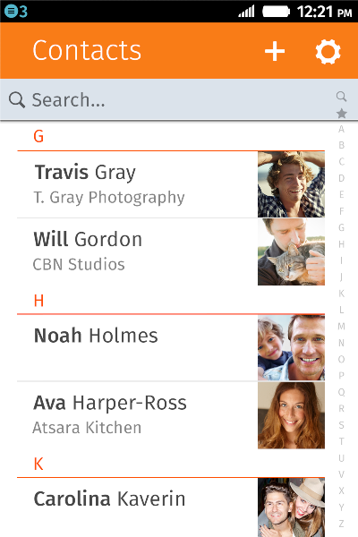

##Firefox OS per utenti e sviluppatori

Scopriamo le sue caratteristiche! 

>Debian/Ubuntu Community Conference  
>Relatore: Daniele Mte90 Scasciafratte (@Mte90Net)

##Chi sono

Sono Daniele Scasciafratte conosciuto nel web come [Mte90](http://www.mte90.net)

* Firefox OS Training Lead per l'Italia
* Fanatico Open Source
* Debian user dal 2009
* Amante di KDE e delle Qt
* Wordpress Developer
* **Mozillian%Mozilla Rep**

##Cos'è Firefox OS
  
Firefox OS **nome in codice Boot to Gecko** è un sistema operativo basato su **Linux** ed **Android**, utilizza standard completamente aperti e il suo codice è disponibile durante lo sviluppo delle varie versioni (Android mi leggi?)

Fonte: [https://developer.mozilla.org/en-US/docs/Mozilla/Firefox_OS](https://developer.mozilla.org/en-US/docs/Mozilla/Firefox_OS)

##Screenshot

##Screenshot

##Screenshot

##Screenshot

##Perchè costa poco?
  

* Mozilla propone **standard aperti**
* Non lucra sul suo sistema
* Realizzato per portare il web mobile a tutti
* Componenti non molto costosi (qualcuno ha detto lo smartphone da 25$?)
* Sistema fluido e funzionale senza grandi esigenze

##Gonk, Gecko e Gaia
  
Un sistema Firefox OS è diviso in tre layer o livelli:

* Gonk - Il livello più basso, Kernel Linux e driver open source
* Gecko - Il motore grafico e le virtual machine Javascript
* Gaia - L'interfaccia utente in HTML5

Fonte: <https://developer.mozilla.org/en-US/docs/Mozilla/Firefox_OS/Platform/Architecture>

##Gecki dappertutto
  
L'interfaccia non è altro che un browser che sfrutta il motore grafico **Gecko** per mostrare le varie applicazioni  

Tutte le applicazioni sono realizzate con i tre Assassini ovvero **HTML/CSS/JS**  

<small>Il sistema è integrato pesantemente con Gecko quindi non si può sostituire con WebKit!</small>

##La leggenda delle Web App lente
  
Come si fà a dire che una Web App è lenta quando i browser hanno fatto passi da gigante negli ultimi anni in termini di performance?  
Specialmente in ambito mobile dove basta realizzare un applicativo fatto bene per non doversi più preoccupare più di niente?

##Web App è fico
In **Firefox OS** si possono ottenere app con le stesse performance di una nativa  

Alcuni esempi di tool/librerie/linguaggi:

* jQuery 2.* invece di jQuery 1.x
* Zepto invece di jQuery
* Mini Framework Javascript 
* Framework CSS Responsive
* ReactJS
* AngularJS
* PolymerJS
* PhoneGap
* Dart

##Building Blocks
**Pubblicità**  
[Building Blocks](http://buildingfirefoxos.com/) è un framework css aggiornato quotidianamente con le ultime modifiche di Gaia che permette di realizzare delle interfacce uguale a quella del sistema  
  
PS: Ci sono i file PSD ma non ditelo ai grafici!

##Web App Hosted vs Packaged
Firefox OS ha due tipi di applicazioni che si **differenziano dai permessi** che hanno sul dispositivo e se **si scaricano fisicamente sul dispositivo**

##I permessi
Su altri sistemi siamo abituati ai permessi di amministrazione.  
Firefox OS specifica i permessi di ogni app nel suo manifest e se permesso dall'utente verranno eseguiti.  
I permessi di root servono solo agli sviluppatori: per il flash semplificato delle rom e si attivano solo con un kernel compilato con l'opzione abilitata

Fonte:[https://developer.mozilla.org/en-US/docs/Mozilla/Firefox_OS/Security](https://developer.mozilla.org/en-US/docs/Mozilla/Firefox_OS/Security), [Apps CSP](https://developer.mozilla.org/en-US/Apps/CSP)

##Hosted

* Con AppCache si possono cachare dei file per uso offline
* Le app sono online quindi su siti web
* Permessi limitati su alcune API (slide successiva)
* Offline sono limitate

  
App di esempio:  

* Facebook
* Twitter

##Privilegi per app Hosted
**Privilegi non critici**

* Geolocazione
* Storage (es: localStorage/sessionStorage/Appcache)
* Sveglia
* Radio
* Notifiche

 
Fonte: [https://developer.mozilla.org/en-US/docs/WebAPI/Permissions](https://developer.mozilla.org/en-US/docs/WebAPI/Permissions)

##Packaged

* Accesso in scrittura e lettura sul telefono
* Possono lavorare anche offline
* Accesso a tutte le API
* Pacchettizate in uno zip

  
App di esempio:

* Tutte quelle presenti di base
* RingTone Picker (oltre 50000 download :-D)

 
Fonte: [https://developer.mozilla.org/en-US/Apps/Developing/Packaged_apps](https://developer.mozilla.org/en-US/Apps/Developing/Packaged_apps)

##Quante API in giro
  
Le API sono presentate al **W3C** come draft  
Alcune API native di Firefox OS

> WebTelephony, Vibration API, WebSMS, Idle API, Screen Orientation, Settings API, Power manager API, Mobile Connection API, TCP Socket API, Geolocation API, WiFi Information API, Device Storage API, Contacts API, Mouse Lock API, Open WebApps, WebBluetooth, Network Information API, Battery Status API, Alarm API, Browser API, Time/Clock API, Web Activities, Push Notification API, Permission API, WebFM API, FileHandle API, Network Stats API, WebPayment

**Alcune API sono disponibili solo per App certificate**

##App a pagamento
  
Mozilla ha realizzato un API in JavaScript per i pagamenti   
 
Fonte: <https://developer.mozilla.org/en-US/docs/Web/Apps/Publishing/In-app_payments>  
<small>Approfondimento: [Working with receipts for paid apps](https://hacks.mozilla.org/2013/10/working-with-receipts-for-paid-apps/)</small>

##Il boilerplate
**Pubblicità!**  
[Firefox OS Boilerplate App](https://github.com/robnyman/Firefox-OS-Boilerplate-App) è uno strumento che vi permetterà di provare sul campo la maggior parte delle API e la gestione multilingua senza grandi difficoltà per scoprire il codice "semplice" che contiene

##Cos'è il Manifest
Il file [manifest.webapp](https://developer.mozilla.org/en-US/docs/Web/Apps/Manifest) è un file JSON contenente le informazioni sull'applicazione  

* Nome, descrizione, lingue supportate e dati sullo sviluppatore
* Orientamento richiesto
* Il percorso di lancio dell'applicazione e le icone
* I permessi richiesti
  
Questo file è **obbligatorio** perchè informa come avviare/usare/richieste l'applicazione  
  <small>PS: Ha un Content-Type specifico _application/x-web-app-manifest+json_ quindi bisogna mandare degli header specifici per questo file tramite il web server </small>

##Marketplace
  
Il Marketplace è gratuito, semplice ed intuitivo e multipiattaforma

**Tutte le app vengono analizzate da tool automatici e successivamente testate da volontari (con dispositivi fisici) per controllare i requisiti e se funziona!**  
 
Fonte: <https://marketplace.firefox.com/developers/>

##Requisiti per lo store ufficiale

* I privilegi (i permessi) devono essere documentati
* Niente iframe per caricare i contenuti dell'app
* Screenshot obbligatorio
* Le lingue specificate devono essere presenti
* Non compromettere il sistema
* Non usare tasti fisici per la navigazione perchè non presenti
* I pulsanti o link devono essere cliccabili/tappabili facilmente
* Regole di buon senso (niente spam, phishing o contenuto illegale)

Fonte: <https://developer.mozilla.org/en-US/docs/Web/Apps/Publishing/Marketplace_review_criteria>

##Cosa consiglio

* La descrizione dell'applicazione deve essere esaustiva
* Se è un gioco deve contenere le istruzioni e non la partita già avviata
* L'interazione deve essere semplice per le varie interfacce (desktop, mobile, tablet)
* Specificare se per Desktop, Mobile, Tablet o per Firefox for Android
* Controllare il file manifest se è corretto tramite il [validatore](https://marketplace.firefox.com/developers/validator)
* Snippet: [FFOS check](https://gist.github.com/Mte90/11087561) e [ff-check](https://gist.github.com/Mte90/11087393)

##Il tuo Marketplace
Con le Open Web App, uno standard per l'installazione delle web app ed accesso ad alcuni API del browser più avanzate, è possibile far installare le app dal proprio sito  
  
Un esempio?  
  
[Firefox OS Bookmark for Wordpress](http://wordpress.org/plugins/firefox-os-bookmark/)  
Permette di installare il proprio sito come app e di caricarla sul marketplace  
  
Poche righe di codice ed un manifest!

##Come testare la propria applicazione
Esiste il simulatore di Firefox OS che è una estensione per Firefox disponibile per [Windows, Mac e Linux](https://ftp.mozilla.org/pub/mozilla.org/labs/fxos-simulator/)  

Le versioni disponibili attualmente sono 1.3-1.4-2.0-2.1-2.2-3.0 insieme ad ADB Helper per il debug remoto.

##Differenze tra simulatore e device fisici
  
Il simulatore sfrutta l'hardware del computer e la versione Gecko di Firefox usata!   
 <small>Alcune API non sono supportate 
Fonte: [https://developer.mozilla.org/en-US/docs/Mozilla/Firefox_OS/Platform/Feature_support_chart](https://developer.mozilla.org/en-US/docs/Mozilla/Firefox_OS/Platform/Feature_support_chart)</small>

##Cosa sono le Web Activity
**Pubblicità**   
Permettono di interfacciare le applicazioni tra di loro (esempio scattare una foto e caricarla su Facebook con l'app ufficiale), per gli sviluppatori Android ricordano gli Android Intents

Fonte: <https://hacks.mozilla.org/2013/01/introducing-web-activities/>

##Debugging remoto
Tramite Firefox e un dispositivo con Firefox OS o Firefox for Android collegato al pc è possibile farlo  

Fonte: <https://developer.mozilla.org/en-US/docs/Tools/Remote_Debugging>

##Come fare un'Open Web App
* Pensa ad un sito web pensato per più interfacce (Desktop, Smartphone e Tablet)
* Scarica il [boilerplate ufficiale](https://github.com/robnyman/Firefox-OS-Boilerplate-App) o [Building Blocks](http://buildingfirefoxos.com/)
* Libera la fantasia
  
Se conosci HTML/CSS/JS ti basta sapere questo!!
   
La documentazione di riferimento è il portale dedicato sul [Mozilla Developer Network](https://developer.mozilla.org/en-US/docs/Mozilla/Firefox_OS)

##Quante volpi
  
Le app presenti sul Marketplace sono per quattro tipi diversi di interfacce/dispositivi  

* Firefox Desktop
* Firefox for Android
* Firefox OS per smartphone
* Firefox OS per tablet

##Le differenze tra Firefox
Il marketplace è disponibile per questi quattro ambienti ma la differenza principale è l'API che supportano (es: la versione desktop non ha l'Orientation API) e la risoluzione  

Se installate un'app su desktop creerà una icona nel menu del sistema, su mobile invece nello screen o nel menu  

##Workflow di sviluppo
* Creare un manifest.webapp
* Realizzare la UI
* Sviluppare e provare tramite browser/simulatore/device
* Se Hosted caricare sul proprio server web (anche Github per esempio)
* Se Packaged comprimere tutto in un file zip
* Inviare l'app sul Marketplace per la recensione

##Web Components
**Pubblicità**   
Sono in [Working Draft](http://www.w3.org/TR/2013/WD-components-intro-20130606/) dal W3C e supportati da Chrome e Firefox.  
Si trattano di nuovi elementi (i widget in poche parole) con tag HTML personalizzati  
Le librerie [Polymer](http://www.polymer-project.org/) di Google e [Brick](http://brick.mozilla.io/) di Mozilla ne includono già pronte come un calendario o la barra di stato.  
 
Fonti: [HTML5Rocks](http://www.html5rocks.com/en/tutorials/webcomponents/customelements/), [Introducing Brick](https://hacks.mozilla.org/2013/08/introducing-brick-minimal-markup-web-components-for-faster-app-development/), [Brickly](http://mte90.github.io/Brickly)

##Varie
  
Quei dettagli che fanno la differenza ma che non sapevo dove mettere

## I crash
  
Le applicazioni sono sotto **sandbox**!  

Ogni file Javascript ha un suo processo, quindi isolamento dei crash (il file và in crash non l'applicazione o il sistema) con un facile debug

## Niente Account
Per usare il telefono non è necessario avere un account impostato sul dispositivo

##Giochi
  
La Disney realizza giochi per Firefox OS, c'è anche Cut the rope  
[Quake Benchmark](https://marketplace.firefox.com/app/quake-benchmark) è un esempio WebGL!

Sul marketplace ce ne sono 2000 (un terzo): [https://marketplace.firefox.com/category/games](https://marketplace.firefox.com/category/games)

<small>Approfondimento: [Optimizing your JavaScript game for Firefox OS](https://hacks.mozilla.org/2013/05/optimizing-your-javascript-game-for-firefox-os/),[E-Book](http://www.amazon.it/Beginning-Firefox-HTML5-Game-Programming-ebook/dp/B00IZUYIGO/ref=sr_1_7?ie=UTF8&qid=1398181859&sr=8-7&keywords=firefox+os)</small>

##Firefox OS multi dispositivo
Firefox OS è scaricabile e compilabile tramite la guida per molti dispositivi ma pochi sono supportati ufficialmente  
  
La pagina su [XDA Developers](http://forum.xda-developers.com/tags.php?tag=firefox+os) contiene diversi esperimenti di porting  
I requisiti per la [compilazione](https://developer.mozilla.org/en-US/docs/Mozilla/Firefox_OS/Firefox_OS_build_prerequisites), [ambiente per la compilazione](https://developer.mozilla.org/en-US/docs/Mozilla/Firefox_OS/Preparing_for_your_first_B2G_build), come fare un [porting](https://developer.mozilla.org/en-US/docs/Mozilla/Firefox_OS/Porting) e la guida per la [compilazione](https://developer.mozilla.org/en-US/docs/Mozilla/Firefox_OS/Building) si trovano su MDN

##Durata della batteria

La batteria dura molto, per esempio una settimana con wifi (me lo ero scordato acceso più di una volta)

##Italiano
  
Firefox OS è tradotto in italiano!  
Per chi vuole approfondire c'è la community [Mozilla Italia](https://mozillaitalia.org)

##Mozilla Italia cerca te!
  
Cerchiamo traduttori, grafici, volontari, markettari, sviluppatori, amanti dell'Open Source.  
Cerchiamo anche un grafico per la realizzazione vettoriale del logo!  

[http://whatcanidoformozilla.org/](http://whatcanidoformozilla.org/)  
[http://codefirefox.com/](http://codefirefox.com/)

##Siti web di riferimento

* [Mozhacks](https://hacks.mozilla.org/category/firefox-os/) - il blog di Mozilla dedicato agli sviluppatori
* [Mozilla Developer Network](https://developer.mozilla.org/it/) - La miglior fonte di informazione per lo sviluppo web
* [Developers Hub](https://marketplace.firefox.com/developers/) - portale del Marketplace dedicato agli sviluppatori
* [Firefox OS Quick Guide](https://github.com/MozillaItalia/firefoxos-quick-guide) - Guida veloce in Italiano con nuovo materiale in scrittura
* [Building Blocks](http://buildingfirefoxos.com/) - Esempi, codice e documentazione per gli sviluppatori
* [Github](http://www.github.com) - Molte applicazione e i prodotti Mozilla sono qui
* [Firefox OS app tools](https://developer.mozilla.org/en-US/Apps/Reference/Firefox_OS_app_tools)

##Applicazioni di esempio

* [Building Cordova apps for Firefox OS](https://hacks.mozilla.org/2014/02/building-cordova-apps-for-firefox-os/)
* [Building a Photo Sharing app for Firefox OS](https://blog.stackmob.com/2013/10/building-a-photo-sharing-app-for-firefox-os/)
* [Building a Firefox OS App for my favorite Internet radio station](https://hacks.mozilla.org/2013/10/building-a-firefoxos-app-for-my-favorite-internet-radio-station/)
* [Firefox OS Boilerplate App](https://github.com/robnyman/Firefox-OS-Boilerplate-App)
* [TrovaTreno](https://github.com/nag-motherfuckers/TrovaTreno)
* [KeeFox](https://github.com/giammyjet/Keefox)
* [Firefox OS Edu](https://github.com/firefoxosedu) - Presentazioni ed esempi

##
  
Se avete domande fatele adesso o mai più (scherzo)  
 
Link presentazione: [http://mte90.github.io/Presentazione-FirefoxOS](http://mte90.github.io/Presentazione-FirefoxOS)  
Presentazione di:  
Daniele Scasciafratte - [Mte90Net](http://twitter.com/Mte90Net) - [Mte90.net](http://www.mte90.net)