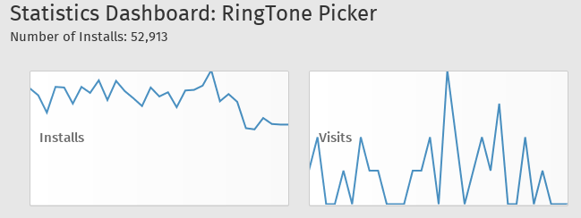

##Firefox OS development for newbie

Develop an app has never been easier

>HTML5 Codeshow Roma - Mozilla Codeshow  
>Speaker: Daniele "Mte90" Scasciafratte (@Mte90Net)

##It's Me Mario Ehm Daniele

Daniele Scasciafratte aka [Mte90](http://www.mte90.net)

* Co-Founder Codeat
* Open Source Developer/Translator/Evangelist
* WordPress Italia Community Member/Translator/Developer
* Industria Italiana del Software Libero Admin
* Debian (sid) user since 2009
* Writer for Italian sites: AndMore's network, ChimeraRevo and TechEconomy
* **Mozillian & Mozilla Reps & Participation Leader**

##Firefox OS

Firefox OS is a **mobile operative system** based on **Linux** and **Android**, divided in three layers:  
**Gonk** (the kernel), **Gecko** (browser engine) and **Gaia** (HTML5 UI)

##You like to win easily, don't you?
  
Firefox OS is **very simple** for a HTML5 **Developer**, Web **Developer**, Lazy **Developer**, Javascript **Developer**, Apps **Developer**, Bored **Developer** etc.  

##Standard W3C APIs
  
Firefox OS use **Gecko**, that **follows the W3C guidelines** for the APIs  
Furthermore many of these API **was born on Firefox OS** like Vibration API or Battery API

##Vendor APIs
  
Firefox OS have **vendor APIs** (often they're privileged) for access to SO features like the Alarm   

##WebActivity APIs
  
WebActivity is the solution for **exchange data/communicate/launch** other app/etc between an app and the other one 

##I choose you

  

> WebTelephony, Vibration API, WebSMS, Idle API, Screen Orientation, Settings API, Power manager API, Mobile Connection API, TCP Socket API, Geolocation API, WiFi Information API, Device Storage API, Contacts API, Mouse Lock API, Open WebApps, WebBluetooth, Network Information API, Battery Status API, Alarm API, Browser API, Time/Clock API, Web Activities, Push Notification API, Permission API, WebFM API, FileHandle API, Network Stats API, WebPayment, IndexedDB, Archive API, Ambient Light Sensor API, Proximity Sensor, SystemXHR, WebNFC etc...

<small>Source: [https://wiki.mozilla.org/WebAPI](https://wiki.mozilla.org/WebAPI)</small>

##Make money!
  
Mozilla has created an API for Web Payment  
<small>Source: <https://developer.mozilla.org/en-US/docs/Web/Apps/Publishing/In-app_payments>  
Library: <https://hacks.mozilla.org/2014/09/introducing-fxpay-for-in-app-payments/>  
[Working with receipts for paid apps](https://hacks.mozilla.org/2013/10/working-with-receipts-for-paid-apps/)</small>

##We want the code!
   
Let's talk about some **useful resources** for the **newbie developer** and the Firefox OS Developer

##Open Web Apps
  

* Web app packaged (local without web server) or hosted (online)
* Installable on (Windows, OSX, Linux, Android, Firefox OS)
* **Pure HTML5, CSS and JavaScript**
* Opened in a window/fullscreen
* In the start menu/launcher
* *In Android a real .apk!*

##Firefox OS Boilerplate App
Let's start with an interactive example!  

* HTML5 API examples like vibration, ambient light, notification etc
* Web Activity examples like send sms, pick image etc
* Privileged API examples like Cross Domain XHR
* Style of **Gaia** (based on Firefox OS Building Blocks)
* Multilanguage with l10n.js (used in Gaia)
* Open Web Apps full support

 <small>[http://robnyman.github.io/Firefox-OS-Boilerplate-App/](http://robnyman.github.io/Firefox-OS-Boilerplate-App/)</small>

##Gaia Components
JavaScript framework of Gaia with documentation

* Each component has its own repo
* Easily Installable
* Versioned separately
* Tested separately
* CSS Variables
* Native UI
* Unit test

 
Demos: [http://wilsonpage.github.io/presentations/web-components-in-production](http://wilsonpage.github.io/presentations/web-components-in-production) , [http://github.com/gaia-components](http://github.com/gaia-components)

##l10n.js

* Multibrowser
* Language files are ini files
* Use `data-l10n` attribute for the string references
* Transifex support
* Require a `<link>` declaration in the `<head>` for config
 
See the boilerplate for example!

##mozPolyfill.js
  
Simple way for adding the missing APIs in the other browsers  

* Multibrowser support
* WebActivity support 
* Useful for debug
* Alert or Console.log message (on send sms, open contact etc...)

[http://mte90.github.io/moz-polyfills/](http://mte90.github.io/moz-polyfills/)

##Official support

  

##Framework with Firefox OS support

* [Cordova](https://developer.mozilla.org/en-US/Apps/Tools_and_frameworks/Cordova_support_for_Firefox_OS)
* [EnyoJS](https://hacks.mozilla.org/2013/03/firefox-os-support-lands-in-enyojs-2-2/)
* [Flambe](https://hacks.mozilla.org/2014/03/flambe-provides-support-for-firefox-os/)
* [Intel App Framework](https://hacks.mozilla.org/2014/05/app-framework-and-firefox-os/)
* Marmelade SDK
* mGWT - In progress

<small>[Dart Firefox OS Boilerplate App](https://github.com/claudiodangelis/dart-FirefoxOS-Boilerplate-App)</small>

##Testing
  

* Firefox Developer Edition
* WebIDE integrated in Firefox
* Firefox OS Simulator (1.3, 1.4, 2.0, 2.1, 2.2, 3.0) an extension for Firefox  
* Devices and Simulator work with WebIDE
* Use ADB to communicate with Firefox OS devices

##Cross Origin Request
  
The principal debug problem in the Open Web Apps is the *[CORS](https://developer.mozilla.org/en-US/docs/Web/HTTP/Access_control_CORS)*  
The flag `mozSystem: true` in the AJAX request disable the block of the browser

##CLI

  

##Node-fxos/Node-firefox
  
Node tools for Firefox OS (gulp and grunt support)  
*Ex: fxos-deploy, fxos-start, x-ports, fxos-reloadcss*  
[http://nicola.github.io/node-fxos/](http://nicola.github.io/node-fxos/#examples)  
[https://github.com/mozilla/node-firefox](https://github.com/mozilla/node-firefox), [Introducing node-firefox](https://hacks.mozilla.org/2015/02/introducing-node-firefox/)

##Documentation
  

##MDN
  

* The first wiki for web developer!  
* HTML5, CSS3, Javascript/Ecmascript6, Firefox Extension, Firefox OS documentation
* References about browser support
* Examples
* Italian translation in progress!

 
[https://developer.mozilla.org/](https://developer.mozilla.org/)

##Developing for Firefox OS
  

* Free Ebook in different format (PDF, Mobi, Epub)
* Italian version in **public beta mode** with new topics (backport in the English version soon)
* Italian, German and Portuguese translation

 
[https://leanpub.com/quickguidefirefoxosdevelopment](https://leanpub.com/quickguidefirefoxosdevelopment)  
[https://leanpub.com/guidavelocesviluppofirefoxos](https://leanpub.com/guidavelocesviluppofirefoxos)

##Workflow
 

##Development Workflow
* Create a manifest.webapp
* Create the UI
* Develop/test in the browser
* Test on simulator/device
* If Hosted upload on your web server (Github is good)
* If Packaged create a zip file

##Manifest validator
  

Simple validator that check your manifest and other little things  

[https://marketplace.firefox.com/developers/validator](https://marketplace.firefox.com/developers/validator)

##Marketplace
  

* Upload your app on the marketplace
* Wait the approval
* Fix the problem reported (if exist)
* Look the statistics!

##Web Site Reference

* [Mozhacks](https://hacks.mozilla.org/category/firefox-os/) - Mozilla blog for web developer
* [Mozilla Developer Network](https://developer.mozilla.org/it/) 
* [**Firefox OS App Tools**](https://developer.mozilla.org/en-US/Apps/Reference/Firefox_OS_app_tools)
* [Firefox Developer Tool vs Firebug](http://www.mte90.net/en/2014/06/firefox-developer-tool-vs-firebug/)
* [Developers Hub](https://marketplace.firefox.com/developers/) - Marketplace Portal for developers
* [Github](http://www.github.com) - Many app are on Github
* [Mozilla Italia Forum](http://forum.mozillaitalia.org/)

##
  
 
Link talk: [http://goo.gl/B79Efy](http://goo.gl/B79Efy)  
Talk by:  
Daniele Scasciafratte - @Mte90Net - [Mte90.net](http://www.mte90.net)